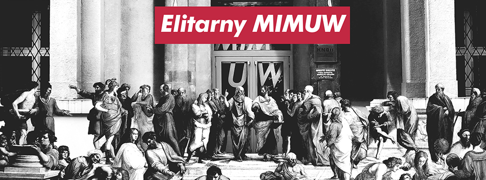

Strona zawiera listę przedmiotów obowiązkowych na kierunku informatyka na MIMUW. Lista przedmiotów, informacje o przedmiotach oraz listy polecanych książek są generowane automatycznie na podstawie wyników wyszukiwania w DuckDuckGo.

# Lista przedmiotów
## [Analiza matematyczna 1  lub Analiza matematyczna 1 z Mathematicą](/mimuw-courses-site/1000-211cAM1/) 
- Liczba godzin: 
	 - Wykłady: 30
	 - Ćwiczenia: 45
	 - Labolatoria: 
- ECTS: 6
- Forma zaliczenia: E

## [Geometria z algebrą liniową](/mimuw-courses-site/1000-211bGAL/) 
- Liczba godzin: 
	 - Wykłady: 30
	 - Ćwiczenia: 60
	 - Labolatoria: 
- ECTS: 6
- Forma zaliczenia: E

## [Podstawy matematyki](/mimuw-courses-site/1000-211bPM/) 
- Liczba godzin: 
	 - Wykłady: 30
	 - Ćwiczenia: 30
	 - Labolatoria: 
- ECTS: 5
- Forma zaliczenia: E

## [Wstęp do programowania](/mimuw-courses-site/1000-211bWPI/) 
- Liczba godzin: 
	 - Wykłady: 60
	 - Ćwiczenia: 60
	 - Labolatoria: 30
- ECTS: 12
- Forma zaliczenia: E

## [Podstawy ochrony własności intelektualnej  (Intellectual property rights - basic course)](/mimuw-courses-site/1000-OOPOWI/) 
- Liczba godzin: 
	 - Wykłady: 4
	 - Ćwiczenia: 
	 - Labolatoria: 
- ECTS: 0,5
- Forma zaliczenia: Z (P/F)

## [Analiza matematyczna 2 lub Analiza matematyczna 2 z Mathematicą](/mimuw-courses-site/1000-212cAM2/) 
- Liczba godzin: 
	 - Wykłady: 30
	 - Ćwiczenia: 60
	 - Labolatoria: 
- ECTS: 6
- Forma zaliczenia: E

## [Matematyka dyskretna](/mimuw-courses-site/1000-212bMD/) 
- Liczba godzin: 
	 - Wykłady: 45
	 - Ćwiczenia: 60
	 - Labolatoria: 
- ECTS: 7
- Forma zaliczenia: E

## [Programowanie obiektowe](/mimuw-courses-site/1000-212cPO/) 
- Liczba godzin: 
	 - Wykłady: 30
	 - Ćwiczenia: 
	 - Labolatoria: 60
- ECTS: 8
- Forma zaliczenia: E

## [Architektura komputerów i systemy operacyjne](/mimuw-courses-site/1000-212bAKSO/) 
- Liczba godzin: 
	 - Wykłady: 30
	 - Ćwiczenia: 
	 - Labolatoria: 30
- ECTS: 6
- Forma zaliczenia: 

## [Algorytmy i struktury danych](/mimuw-courses-site/1000-213bASD/) 
- Liczba godzin: 
	 - Wykłady: 30
	 - Ćwiczenia: 30
	 - Labolatoria: 30
- ECTS: 9
- Forma zaliczenia: E

## [Bazy danych](/mimuw-courses-site/1000-213bBD/) 
- Liczba godzin: 
	 - Wykłady: 15
	 - Ćwiczenia: 
	 - Labolatoria: 15
- ECTS: 4
- Forma zaliczenia: E

## [Programowanie współbieżne](/mimuw-courses-site/1000-213bPW/) 
- Liczba godzin: 
	 - Wykłady: 30
	 - Ćwiczenia: 30
	 - Labolatoria: 30
- ECTS: 9
- Forma zaliczenia: E

## [Rachunek prawdopodobieństwa](/mimuw-courses-site/1000-213bRP/) 
- Liczba godzin: 
	 - Wykłady: 30
	 - Ćwiczenia: 30
	 - Labolatoria: 
- ECTS: 5
- Forma zaliczenia: E

## [Kurs C++  lub Kurs Pythona](/mimuw-courses-site/1000-213bCPP/) 
- Liczba godzin: 
	 - Wykłady: 
	 - Ćwiczenia: 
	 - Labolatoria: 30
- ECTS: 4
- Forma zaliczenia: ZO (G)

## [Sieci komputerowe](/mimuw-courses-site/1000-214bSIK/) 
- Liczba godzin: 
	 - Wykłady: 30
	 - Ćwiczenia: 
	 - Labolatoria: 30
- ECTS: 7
- Forma zaliczenia: E

## [Aplikacje WWW](/mimuw-courses-site/1000-214bWWW/) 
- Liczba godzin: 
	 - Wykłady: 30
	 - Ćwiczenia: 
	 - Labolatoria: 30
- ECTS: 7
- Forma zaliczenia: E

## [Języki, automaty i obliczenia](/mimuw-courses-site/1000-214bJAO/) 
- Liczba godzin: 
	 - Wykłady: 30
	 - Ćwiczenia: 30
	 - Labolatoria: 
- ECTS: 5
- Forma zaliczenia: E

## [Inżynieria oprogramowania](/mimuw-courses-site/1000-214bIO/) 
- Liczba godzin: 
	 - Wykłady: 30
	 - Ćwiczenia: 
	 - Labolatoria: 
- ECTS: 3
- Forma zaliczenia: E

## [Wstęp do uczenia maszynowego](/mimuw-courses-site/1000-214bWUM/) 
- Liczba godzin: 
	 - Wykłady: 30
	 - Ćwiczenia: 
	 - Labolatoria: 30
- ECTS: 7
- Forma zaliczenia: E

## [Zespołowy projekt programistyczny](/mimuw-courses-site/1000-2L5ZPP/) 
- Liczba godzin: 
	 - Wykłady: 
	 - Ćwiczenia: 
	 - Labolatoria: 60
- ECTS: 9
- Forma zaliczenia: ZO (G)

## [Problemy społeczne i zawodowe informatyki](/mimuw-courses-site/1000-214bPSZ/) 
- Liczba godzin: 
	 - Wykłady: 30
	 - Ćwiczenia: 
	 - Labolatoria: 
- ECTS: 3
- Forma zaliczenia: ZO (G)

